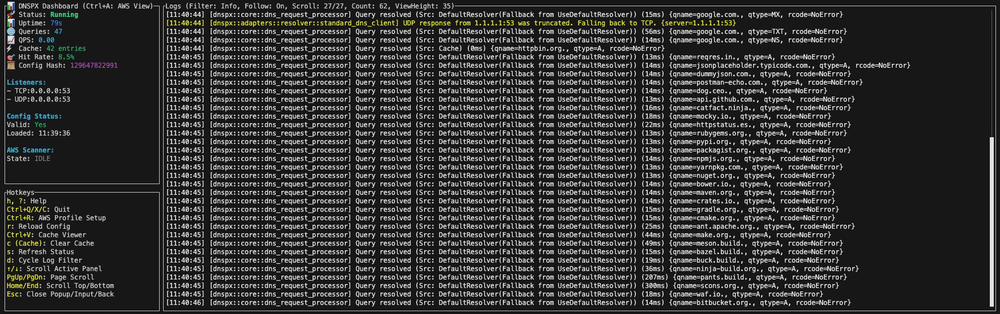
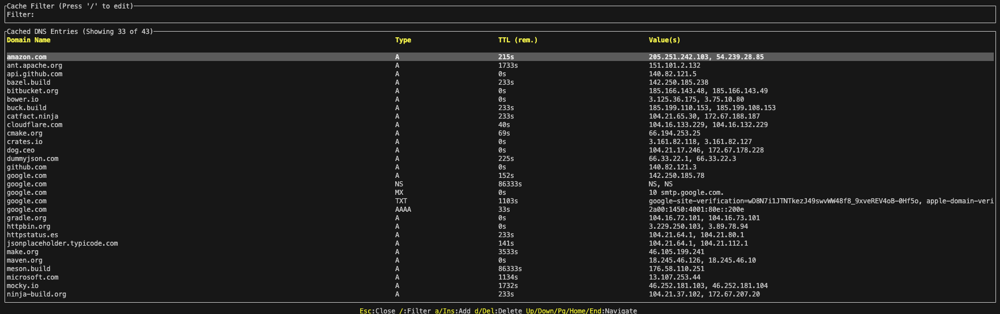

# DNSPX - DNS Proxy & Resolver

 <!-- Replace with actual logo -->

DNSPX is a configurable DNS proxy and resolver designed for local development and cloud environments, featuring request caching, rule-based routing, and AWS service discovery.

[](https://github.com/nbyx/dnspx/actions/workflows/ci.yml)


## ⚠️ AWS Integration Status
AWS service discovery is implemented but not extensively tested in production environments. Please test thoroughly in your specific AWS setup before relying on it for critical workloads.

## 📸 Screenshots

### Main Dashboard (TUI)

*Real-time DNS query monitoring withperformance metrics and log analysis*

### Cache Viewer (TUI)

*Comprehensive DNS cache inspection with TTL tracking*


## ✨ Features

### ⚙️ Core Functionality
*   **DNS Proxy:** Forwards DNS queries to upstream resolvers (UDP & TCP).
*   **Configurable Resolvers:** Supports standard DNS (UDP/TCP) and DNS-over-HTTPS (DoH) upstream resolvers.
*   **Flexible Resolver Strategies:** `First`, `Random`, `Rotate`, `Fastest` (for rules/default).
*   **Caching:** In-memory cache for DNS responses to reduce latency and upstream load.
    *   Configurable TTL (min/max).
    *   Option to serve stale entries on upstream error.
*   **Rule-Based Routing:** Direct queries based on domain patterns to specific resolvers or actions (Block, Allow, ResolveLocal, Forward).
*   **Local Hosts Resolution:** Serves records from a configurable local hosts mapping.

### ☁️ Cloud Integration
*   **AWS Service Discovery:**
    *   Discovers AWS resources (VPC Endpoints, EC2 instances, RDS, ElastiCache, DocumentDB, Private API Gateways) using specified AWS profiles or credentials.
    *   Automatically creates DNS entries for discovered resources in the internal cache.
    *   Supports IAM role assumption for cross-account access.
    *   Handles MFA for AWS authentication.
    *   Discovers Route 53 Inbound Resolver Endpoints and Private Hosted Zones for enhanced VPC-internal name resolution.
*   **AWS Profile Management:** TUI interface for setting up and testing AWS account configurations.

### 📊 Monitoring & Management
*   **Text User Interface (TUI):**
    *   Real-time dashboard showing status, query count, QPS, cache statistics, and listener status.
    *   Live log viewer with filtering capabilities.
    *   Interactive DNS cache viewer with options to add/delete synthetic entries.
    *   AWS Scanner status and detailed error reporting.
*   **Query Logging:** Optional logging of processed DNS queries.
*   **Status Reporting:** Provides detailed application status including configuration validity and AWS scanner activity.

### 📄 Configuration
*   **File-Based Configuration:** Single TOML file (`dnspx_config.toml`) for all settings.
*   **Legacy JSON Configuration Migration:** Supports automatic migration from older JSON-based configuration files.
*   **Dynamic Configuration Reload:** Monitors the configuration file for changes and reloads automatically.
*   **CLI Options:**
    *   `--config <path>`: Specify a custom configuration file path.
    *   `--tui`: Launch the TUI dashboard.
    *   `--cli-only`: Run in a simple command-line mode without the TUI.

## 🚀 Installation & Usage

### Prerequisites
*   Rust 1.70 or later.
*   AWS CLI configured (recommended for easier AWS profile setup, especially for AWS service discovery features).

### Build from source
```bash
git clone https://github.com/nbyx/dnspx # Replace username/dnspx
cd dnspx
cargo build --release
```

### Basic usage
```bash
# Start DNS proxy using default config (dnspx_config.toml in current dir or user config)
./target/release/dnspx

# Start DNS proxy with a specific configuration file
./target/release/dnspx --config /path/to/your/config.toml

# Launch TUI monitoring interface
./target/release/dnspx --tui

# Run in simple CLI mode (no TUI dashboard)
./target/release/dnspx --cli-only
```

## ⚙️ Configuration

DNSPX is configured using a TOML file, typically named `dnspx_config.toml`.
If no `--config` flag is provided, it looks for `dnspx_config.toml` in the current directory, then in the user's config directory (e.g., `~/.config/dnspx/dnspx_config.toml`).

### Example `dnspx_config.toml`:
```toml
# Server settings
[server]
listen_address = "0.0.0.0:53"       # Address and port to listen on
protocols = ["Udp", "Tcp"]          # Protocols to listen on (Udp, Tcp)
# network_whitelist = ["192.168.1.0/24", "10.0.0.1"] # Optional: Restrict access
default_query_timeout = "500ms"    # Default timeout for DNS queries originating from clients

# Default upstream resolver configuration (used if no rules match)
[default_resolver]
nameservers = ["1.1.1.1:53", "https://cloudflare-dns.com/dns-query"] # Mix of standard DNS and DoH
strategy = "First"                  # "First", "Random", "Rotate", "Fastest"
timeout = "500ms"                   # Timeout for upstream queries
# doh_compression_mutation = false  # Obscure DoH setting, rarely needed

# DNS cache settings
[cache]
enabled = true
max_capacity = 10000
min_ttl = "1m"                      # Minimum TTL for cached entries
max_ttl = "1d"                      # Maximum TTL for cached entries
serve_stale_if_error = true         # Serve stale cache if upstream fails
serve_stale_max_ttl = "1h"          # Max age of stale entry to serve

# Local hosts definitions
# [local_hosts]
# entries = { "my.local.service" = "192.168.1.100", "another.one" = "10.0.0.5" }
# file_path = "/etc/dnspx_hosts" # Optional: path to a hosts file (not yet fully implemented for file format)
# watch_file = true # Optional: watch file_path for changes (not yet fully implemented)

# Routing rules
# [[routing_rules]]
# name = "Block Ads"
# domain_pattern = "(^|\\.)adservice\\.google\\.com$" # Regex pattern
# action = "Block" # "Forward", "Block", "Allow", "ResolveLocal"
# invert_match = false # Optional: if true, rule applies to non-matching domains

# [[routing_rules]]
# name = "Internal Services via Specific DNS"
# domain_pattern = "\\.corp\\.internal$"
# action = "Forward"
# nameservers = ["10.0.1.1:53", "10.0.1.2:53"]
# strategy = "Rotate"
# timeout = "200ms"

# HTTP Proxy for DoH requests (optional)
# [http_proxy]
# url = "http://proxy.example.com:8080"
# username = "user" # Optional
# password = "password" # Optional

# AWS Integration settings (optional)
# [aws]
# default_region = "us-east-1"
# output_file_name = "aws_proxy_bypass.txt" # Optional: File for discovered AWS domains
# scan_interval = "15m" # How often to rescan AWS resources
# credentials_cache_enabled = true
# credential_cache_ttl = "50m"
# [[aws.accounts]]
# label = "dev-account" # User-friendly label for TUI
# profile_name = "my-dev-profile" # AWS CLI profile name
# # account_id = "123456789012" # Optional: For verification
# # scan_vpc_ids = ["vpc-012345abcdef", "vpc-fedcba543210"] # VPCs to scan
# # scan_regions = ["us-east-1", "eu-west-2"] # Regions to scan for this account
# #   [aws.accounts.discover_services] # Control which services are discovered
# #   vpc_endpoints = true
# #   ec2_instances = true
# #   rds_instances = true
# #   elasticache_clusters = true
# #   docdb_clusters = true
# #   api_gateways_private = true
# #   [[aws.accounts.roles_to_assume]]
# #   role_arn = "arn:aws:iam::098765432109:role/AnotherRole"
# #   label = "assumed-role-label" # Optional

# Logging configuration
[logging]
level = "info"                      # "trace", "debug", "info", "warn", "error"
format = "Pretty"                   # "Pretty", "Json", "Compact"
query_log_enabled = false           # If true, logs every DNS query

# CLI/TUI behavior
[cli]
enable_colors = true                # Enable/disable colors in CLI/TUI output
status_refresh_interval_secs = 5    # TUI status panel refresh interval
```

### Key Configuration Parameters:
*   **`server.listen_address`**: IP and port DNSPX listens on (e.g., `0.0.0.0:53`).
*   **`default_resolver.nameservers`**: List of upstream DNS servers (IP:Port or DoH URLs) used if no specific rule matches.
*   **`routing_rules`**: An array of rules. Each rule has:
    *   `name`: A descriptive name.
    *   `domain_pattern`: A regex pattern to match domain names.
    *   `action`: What to do if the pattern matches (`Forward`, `Block`, `Allow`, `ResolveLocal`).
    *   `nameservers` (for `Forward`): Specific upstreams for this rule.
*   **`cache`**: Configures caching behavior (TTL, capacity).
*   **`aws`**: Configures AWS integration for service discovery.
    *   `accounts`: List of AWS accounts to scan, typically referencing AWS CLI profiles.
    *   `discover_services`: Fine-grained control over which AWS service types are discovered.
*   **`logging`**: Controls log level and format.

## 🏛️ Architecture Overview

DNSPX is designed with a modular architecture, loosely following the **Ports and Adapters** (Hexagonal Architecture) pattern.

*   **Core Domain (`core/`)**: Contains the business logic, including the DNS request processing pipeline, caching logic (`DnsCache`), rule engine (`RuleEngine`), and local hosts resolution (`LocalHostsResolver`). It defines traits (ports) for external interactions.
*   **Adapters (`adapters/`)**: Implement the ports defined by the core. These handle I/O, external service integrations, and UI.
    *   **Server Adapters (`adapters/server/`)**: Handle incoming DNS requests (UDP/TCP listeners).
    *   **Resolver Adapters (`adapters/resolver/`)**: Implement upstream DNS resolution (standard DNS, DoH).
    *   **AWS Adapters (`adapters/aws/`)**: Manage AWS credentials and VPC/service discovery.
    *   **Configuration Adapter (`adapters/config/`)**: Handles loading and saving configuration from/to files.
    *   **TUI Adapter (`adapters/tui/`)**: Provides the text-based user interface.
    *   **CLI Adapter (`adapters/cli/`)**: Provides the command-line interface.
    *   **Status Adapter (`adapters/status/`)**: Manages and reports application status.
*   **Ports (`ports/`)**: Defines the interfaces (Rust traits) between the core domain and the adapters. This promotes decoupling.
*   **App Lifecycle (`app_lifecycle.rs`)**: Manages the overall application state, startup, shutdown, and coordination between components.

DNSPX listens on the configured port (default 53) for UDP and TCP DNS queries. Requests are processed through a pipeline involving local hosts, caching, rule-based routing, and finally upstream resolution if necessary. AWS discovery runs periodically in the background to update internal DNS records for AWS services.

## 🛠️ Development

### Running Tests
```bash
cargo test
```

### Running the DNS Proxy Test Suite
This script tests basic functionality, caching, and some performance aspects.
```bash
./test/dns-proxy-test.sh
```
*(Ensure `dnspx` is running and accessible at `127.0.0.1:53` before running the test script, or modify the script's `PROXY_HOST` and `PROXY_PORT` variables.)*

### Building for Production
```bash
cargo build --release
# Potentially with features, e.g.:
# cargo build --release --features production
```

## 📦 Deployment Options

*   **Local Development:** Run directly using `cargo run` or the compiled binary. Ideal for local development setups needing custom DNS resolution.
*   **Docker Deployment:** (Dockerfile not yet provided) DNSPX can be containerized for deployment.
*   **Cloud Deployment (AWS/Azure/GCP):** Can be deployed on a VM or container service in cloud environments. For AWS, it can leverage IAM roles for service discovery.

## 📈 Performance

Performance results are based on the included `dns-proxy-test.sh` script. These represent functional DNS proxy performance with standard caching benefits.

### Test Environment
*   DNS Proxy: `127.0.0.1:53` (running locally)
*   Fallback DNS for comparison: `1.1.1.1`
*   Test domains: 8 popular websites, plus others for specific tests.
*   Machine: (Specify your test machine: e.g., Core i7, 16GB RAM, Linux)

### Results
| Metric                  | Value                | Notes                                     |
|-------------------------|----------------------|-------------------------------------------|
| Avg. Response Time      | ~26.69ms             | With caching enabled (for repeated queries) |
| Cache Hit Improvement   | ~20% faster          | Second query vs. first for same domain    |
| Concurrent Throughput   | ~250 queries/sec     | Peak under burst load (10 concurrent)     |
| Sustained Throughput    | ~31.74 queries/sec   | Under continuous load (20 queries)        |
| Success Rate            | 100%                 | All test queries resolved correctly       |
| Proxy Overhead (vs 1.1.1.1) | ~20%                 | For uncached queries, typical proxy layer |

### Cache Performance Detail
*   **Cache Miss (first query to a new domain):** ~33ms (example value)
*   **Cache Hit (subsequent query to same domain):** ~26ms (example value)
*   **Improvement:** Standard ~20% reduction in response time due to caching.

*Note: These are example values derived from the test script's calculations and prompt guidance. Actual performance may vary based on network conditions, upstream resolver speed, and hardware.*

## 🗺️ Roadmap

*   [ ] Enhanced rule conditions (e.g., client IP, specific record types).
*   [ ] Support for DoT (DNS-over-TLS) upstream resolvers.
*   [ ] More robust AWS service discovery options and richer metadata.
*   [ ] Support for other cloud provider service discovery (Azure, GCP).
*   [ ] Persistent cache option (e.g., SQLite, Redis).

## 🤝 Contributing

Contributions are welcome! Please feel free to:
*   Submit a Pull Request with your proposed changes.
*   Open an Issue to report bugs, suggest features, or ask questions.
*   Participate in Discussions.

Please follow standard GitHub Fork & Pull Request workflows. Ensure your code is formatted with `rustfmt` and passes `cargo clippy` and `cargo test`.

